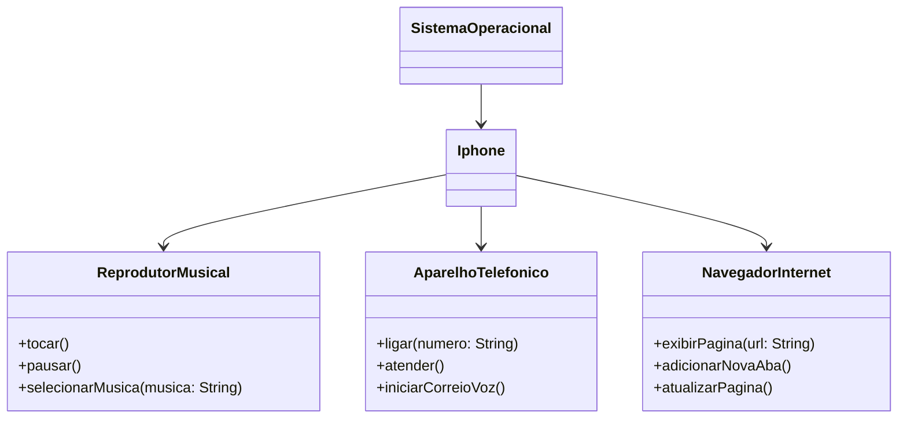

  <h1>- Desafio: POO -</h1>

Este repositório, concebido com propósitos didáticos, representa um desafio de modelagem e diagramação, utilizando UML, para um componente iPhone, abrangendo suas funcionalidades como reprodutor musical, aparelho telefônico e navegador na internet, criado em colaboração entre a [Digital Innovation One](https://www.dio.me/) e o Santander, como parte do Bootcamp Santander 2024 - Backend com Java.

## Objetivo

Aprender e aplicar os fundamentos de Programação Orientada a Objetos (POO) e Linguagem de Modelagem Unificada (UML), os quais incluem:

- Conceito de POO;
- Classes e pacotes;
- Visibilidade dos recursos;
- PIlares do POO;
- Interface.

## Ferramentas e tecnologias

 

## Diagrama UML

## Funcionamento
Os dados são solicitados e inseridos através do terminal, onde o usuário receberá um menu indicando as opções a serem escolhidas e seus repectivos números. Por exemplo:

* Programa:  
---- Escolha o aplicativo ----  
1. Reprodutor musical  
2. Aparelho telefônico  
3. Navegador de internet  
4. Encerrar aparelho
* Usuário: 1 *(depois ENTER para o próximo passo)* 

 

